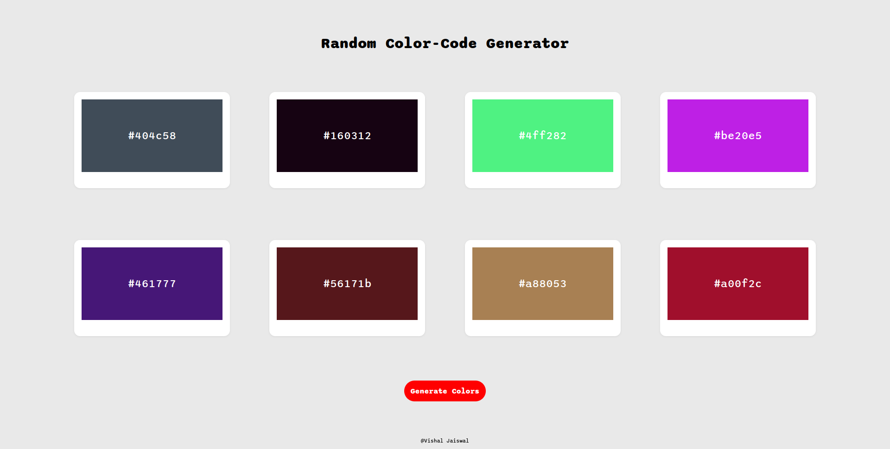

# Random Color Code Generator

> ### Objective 
     *To build a random hex olor-code using JavaScript, HTML and CSS*  
 

> ### Concepts used    
1. 
2. `Math.random()` method generating numbers greater than zero and less than one(float values)
3. `.toString()` method is used to convert an object to a primitive value. Here it's converting the float number to string so that it can be used by substring() method(substring() only accepts string values and not numbers).
4. `anyString.substring(startIndex, endIndex)` used to exclude the letters before startIndex and after endIndex.
5. `anyList.forEach((currentElementBeingProcessedInTheList)={ /***/ })` method is used to provide function once for each array elements.
6. `Element.innerHTML` is used to access the HTML contained within the element. Here we're using it to change the text inside innerHTML of element selected by query selector.
7. `Element.style.anyCSSproperty` can be used to change the style.

 

> ### Sample Preview :  

 

> ### Github Learning  
     How to revert back to previous commit:
     1. git log  : shows commit ids of all commits
     2. git reset {commit id which you want back} --hard : return back to code of previous commit and displays changes in local machine too.
     3. git add
     4. git commit
     5. git push -f origin {branch} : -f is fast-forward
